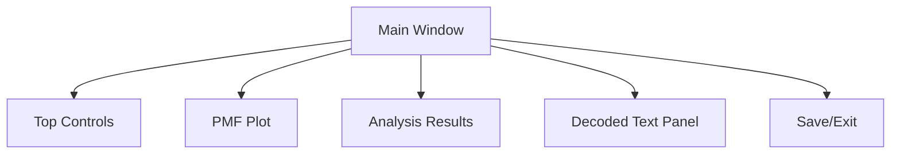
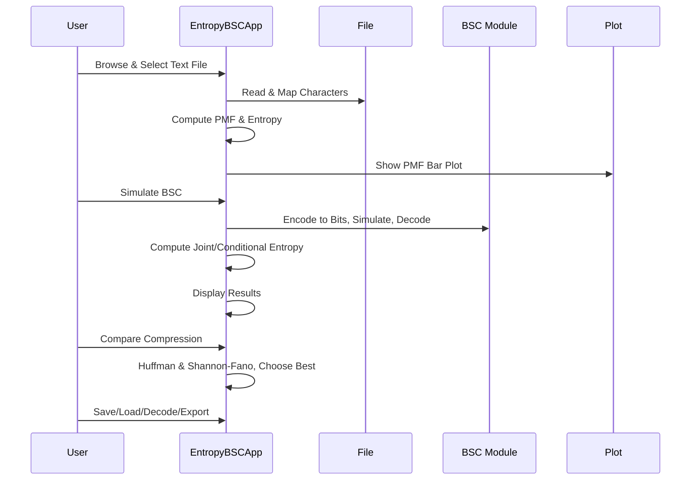

# Entropy & BSC Simulation + Encode/Decode Tool Documentation

This application provides a comprehensive GUI dashboard for **text entropy analysis, compression (Huffman & Shannon-Fano), and Binary Symmetric Channel (BSC) simulation**. It integrates text processing, probability and entropy calculation, compression, noisy channel simulation, and decoding — all in a single, user-friendly window.

---

## ✨ Main Features

- **Text File Loading**: Supports `.txt` files, accepting only a custom 64-character alphabet.
- **Character Mapping**: Non-alphabet symbols are replaced with a space.
- **Probability Mass Function (PMF) Computation**: Computes and visualizes character distribution.
- **Entropy Calculations**: Calculates entropy, relative entropy, joint and conditional entropy.
- **Compression Algorithms**: Huffman and Shannon-Fano. The app compares both and picks the most efficient.
- **Binary Symmetric Channel (BSC) Simulation**: Simulates bit errors with configurable probability.
- **Encoding/Decoding**: Encodes, transmits, and decodes text using variable-length codes and fixed 6-bit encoding.
- **Rich GUI (Tkinter)**: All controls, results, and plots are in a single dashboard.
- **File Export & Import**: Save and load compressed data, PMF plots, CSVs, and reports.
- **Integrated Decoded Text View**: Load encoded files and see decoded text directly in the dashboard.

---

## 🗂️ Alphabet & Character Mapping

The tool restricts its analysis to a **custom 64-character alphabet**, consisting of:

| Type      | Characters                              |
|-----------|-----------------------------------------|
| Lowercase | a-z                                     |
| Uppercase | A-Z                                     |
| Digits    | 1-9                                     |
| Symbols   | Space, comma, period                    |

Any character outside this set is **mapped to a space**.

### Example Mapping

```python
def map_char(c, fallback=' '):
    """Map char to allowed alphabet or fallback (space)."""
    return c if c in ALPHABET_INDEX else fallback
```

---

## 📊 PMF & Entropy Calculation

### Probability Mass Function (PMF)

- **Computes character frequencies** in the loaded text.
- PMF is shown as a **bar plot** (Matplotlib embedded in the GUI).

### Entropy and Divergence

- **Shannon Entropy H(X):** Quantifies information in the text.
- **Relative Entropy D(P || U):** Kullback-Leibler divergence from uniform distribution.

### Functions

```python
def pmf_from_list(mapped_chars):
    counts = Counter(mapped_chars)
    total = sum(counts.values())
    pmf = {c: (counts.get(c, 0) / total if total > 0 else 0.0) for c in ALPHABET}
    return counts, pmf, total

def entropy_from_pmf(pmf):
    return -sum(p * math.log2(p) for p in pmf.values() if p > 0)
```

---

## 🗜️ Compression Algorithms

The app compares **Huffman** and **Shannon-Fano** coding schemes for compressing the text:

| Algorithm    | Description                                            |
|--------------|-------------------------------------------------------|
| Huffman      | Greedy optimal prefix code, based on symbol frequency |
| Shannon-Fano | Recursive symbol partitioning, near-optimal           |

- **Automatically chooses the more efficient one** (lower average code length).
- In case of a tie, chooses Shannon-Fano.

### Compression Process

1. Calculates codes for each symbol.
2. Encodes the text as a bitstring using the chosen codebook.
3. Saves codebook and encoded data into a JSON `.txt` file.

#### Compression Comparison Table

| Metric                   | Huffman         | Shannon-Fano     |
|--------------------------|-----------------|------------------|
| Average Code Length      | (computed)      | (computed)       |
| Runtime                  | (measured)      | (measured)       |

---

## 🛰️ Binary Symmetric Channel (BSC) Simulation

The tool simulates **noisy transmission**:

- **Fixed 6-bit encoding** per symbol (covers 64-character alphabet).
- Each bit has probability *p* of being flipped (default 0.05).
- Optional random seed for reproducibility.

### Process Flow

```mermaid
flowchart TD
    A[Text Input] --> B[Character Mapping]
    B --> C[6-bit Encoding]
    C --> D[BSC Simulation (bit flipping)]
    D --> E[6-bit Decoding]
    E --> F[Recovered Text]
```

### Entropy Calculations After BSC

- **Joint Entropy H(X, Y):** Between original and received symbols.
- **Conditional Entropy H(Y|X):** Uncertainty in output given input.
- **Chain Rule Verification:** Checks if H(X, Y) ≈ H(X) + H(Y|X)

---

## 🖥️ GUI Dashboard

The GUI is built using **Tkinter** and is organized as follows:

- **Top Controls**: File operations, BSC probability, random seed, analysis triggers.
- **PMF Plot**: Embedded Matplotlib plot showcasing the PMF.
- **Results Panel**: Shows entropy, divergence, and other key metrics.
- **Decoded Area**: Integrated panel for viewing decoded text from compressed files.
- **Bottom Controls**: Save/export operations, exit.

### GUI Layout



---

## 🛠️ File Save/Load and Export Capabilities

- **Save compressed data** (JSON with codebook and encoded bitstring).
- **Load compressed file** and decode within the dashboard.
- **Export analysis results**: PMF plot, PMF CSV, decoded output, and a report.

---

## 🧑‍💻 Key Classes & Functions

### EntropyBSCApp (Tkinter GUI)

- **State**: Holds all computed results, current text, compressed data, etc.
- **Controls**: Provides handlers for all user actions.
- **Main Methods**:
  - `process_file`: Loads, maps, analyzes text, and simulates BSC.
  - `compare_and_show`: Compares compression schemes.
  - `save_compressed_file`: Exports compressed data.
  - `load_compressed_and_decode_dashboard`: Loads and decodes a compressed file directly in the dashboard.
  - `save_decoded_from_dashboard`: Saves currently displayed decoded text.
  - `save_results`: Saves all results (plots, CSV, text files) to a selected directory.

### Compression & Decoding

- **Huffman & Shannon-Fano**: Implemented from scratch using heap/recursive partitioning.
- **Prefix Decoding**: Uses a trie for efficient codeword decoding.

---

## ⚙️ Core Data Flow



---

## 📋 API-Like Operations

While this is a desktop app, **key operations can be mapped as pseudo-API endpoints** for clarity, especially for batch processing or future web/CLI adaptation.

### 1. Process Text File

```api
{
    "title": "Process Text File",
    "description": "Load and analyze a text file, compute PMF, entropy, and simulate BSC.",
    "method": "POST",
    "baseUrl": "local-application",
    "endpoint": "/process-file",
    "headers": [],
    "queryParams": [],
    "pathParams": [],
    "bodyType": "json",
    "requestBody": "{\n  \"filepath\": \"example.txt\",\n  \"p_bsc\": 0.05,\n  \"seed\": \"random\"\n}",
    "responses": {
        "200": {
            "description": "Analysis completed",
            "body": "{\n  \"pmf\": {\"a\": 0.02, ...},\n  \"entropy\": 4.62,\n  \"divergence\": 0.12,\n  \"bsc_decoded\": \"...\",\n  \"joint_entropy\": 4.95\n}"
        },
        "400": {
            "description": "Invalid file or parameters",
            "body": "{\n  \"error\": \"File not found\"\n}"
        }
    }
}
```

### 2. Compare Compression Algorithms

```api
{
    "title": "Compare Compression",
    "description": "Compare Huffman and Shannon-Fano coding for the loaded text.",
    "method": "POST",
    "baseUrl": "local-application",
    "endpoint": "/compare-compression",
    "headers": [],
    "queryParams": [],
    "pathParams": [],
    "bodyType": "none",
    "requestBody": "",
    "responses": {
        "200": {
            "description": "Comparison result",
            "body": "{\n  \"chosen_algorithm\": \"Huffman\",\n  \"L_huffman\": 5.1,\n  \"L_shannon_fano\": 5.2,\n  \"codes\": {\"a\": \"110\", ...}\n}"
        },
        "400": {
            "description": "PMF not computed",
            "body": "{\n  \"error\": \"Process a file first to obtain PMF.\"\n}"
        }
    }
}
```

### 3. Save Compressed File

```api
{
    "title": "Save Compressed File",
    "description": "Export compressed bitstring and codebook to a file.",
    "method": "POST",
    "baseUrl": "local-application",
    "endpoint": "/save-compressed",
    "headers": [],
    "queryParams": [],
    "pathParams": [],
    "bodyType": "json",
    "requestBody": "{\n  \"algorithm\": \"Huffman\",\n  \"codebook\": {\"a\": \"110\", ...},\n  \"encoded_data\": \"010101...\",\n  \"metadata\": {\"source_file\": \"input.txt\"}\n}",
    "responses": {
        "200": {
            "description": "File saved",
            "body": "{\n  \"path\": \"output_compressed.txt\"\n}"
        },
        "400": {
            "description": "No compressed data",
            "body": "{\n  \"error\": \"No compressed data present.\"\n}"
        }
    }
}
```

### 4. Load and Decode Encoded File

```api
{
    "title": "Load and Decode Encoded File",
    "description": "Load a compressed file and decode its content.",
    "method": "POST",
    "baseUrl": "local-application",
    "endpoint": "/load-decode",
    "headers": [],
    "queryParams": [],
    "pathParams": [],
    "bodyType": "json",
    "requestBody": "{\n  \"filepath\": \"compressed.txt\"\n}",
    "responses": {
        "200": {
            "description": "Decoded content",
            "body": "{\n  \"decoded_text\": \"The original message ...\"\n}"
        },
        "400": {
            "description": "Invalid file or decode error",
            "body": "{\n  \"error\": \"Failed to read compressed file.\"\n}"
        }
    }
}
```

---

## 📦 File Formats

### Compressed File (JSON in `.txt`)

```json
{
  "algorithm": "Huffman",
  "codebook": {"a": "110", ...},
  "encoded_data": "010101...",
  "metadata": {
    "source_file": "input.txt",
    "total_symbols": 1000,
    "timestamp": 1680000000.0
  }
}
```

---

## 🚦 Error Handling

- **File not found**: Prompts error dialog.
- **Invalid compressed file**: Checks for required keys.
- **Decode failures**: Handles exceptions during prefix decode.
- **No data to save**: Warns user if actions are not ready.

---

## 🎨 PMF Visualization

The **Probability Mass Function (PMF) plot** is generated using Matplotlib and integrated into the GUI. This helps visualize symbol distribution in the input file.

---

## 🔒 Extensibility & Security

- **Alphabet is fixed** for reproducibility.
- **Random seed** can be set for deterministic BSC simulation.
- **All file operations** are user-driven, no code execution in loaded files.

---

## 📝 Author & Usage

- **Authors**: Ahmed Salah, Hassan Rashwan, Ahmed Gamal.
- **Usage**: Save as a Python file and run with Python 3. Requires `tkinter`, `numpy`, `matplotlib`.

---

## 🧠 Summary Table

| Feature                | Description                                                          |
|------------------------|----------------------------------------------------------------------|
| Alphabet Restriction   | 64-character set, non-members mapped to space                        |
| PMF/Entropy            | Shows entropy, divergence, and PMF plot                              |
| Compression            | Huffman vs. Shannon-Fano, saves codebook/bitstring                   |
| BSC Simulation         | Fixed 6-bit/channel simulation with p, seed                          |
| Decoding               | Integrated dashboard pane, direct save                               |
| Export                 | Plots, CSV, reports, compressed files, decoded text                  |
| GUI                    | Tkinter, all-in-one dashboard                                        |
| Error Handling         | User-friendly dialogs for missing files, decode errors, etc.          |

---

## 🏁 How to Run

1. Save the provided code as `entropy_bsc_dashboard.py`.
2. Make sure you have Python 3, `tkinter`, `numpy`, and `matplotlib` installed.
3. Run:

```bash
python entropy_bsc_dashboard.py
```

---

## 🛡️ Final Notes

This tool is ideal for **educational, academic, and practical exploration** of information theory, compression, and digital communications concepts. The dashboard approach ensures clarity and usability for both novices and experts.

---

**Happy exploring entropy and coding theory! 🎉**
